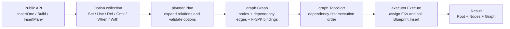
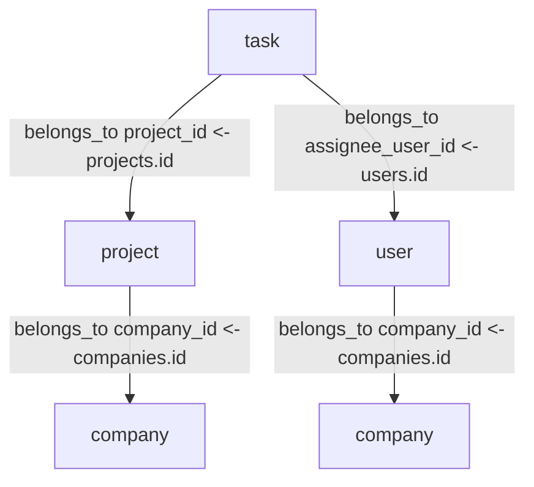
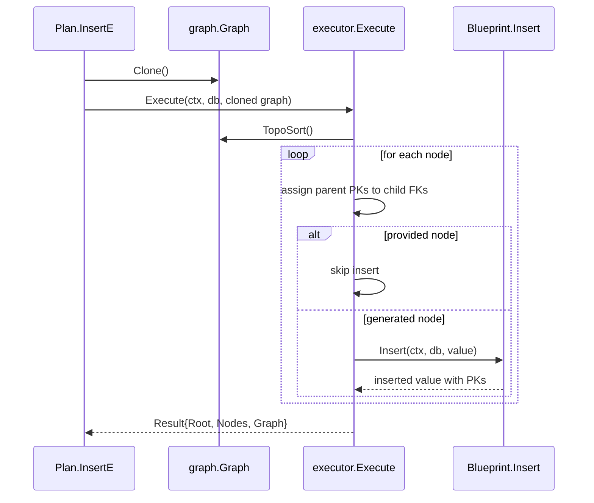
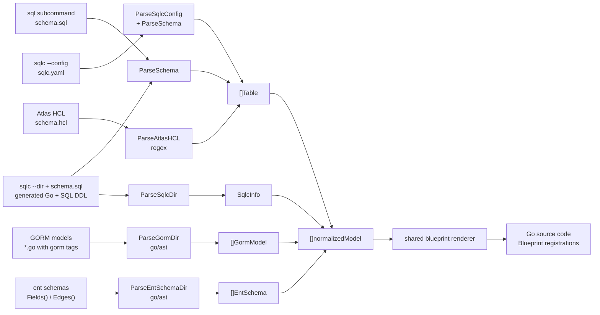

# seedling architecture

Internal design documentation explaining how seedling turns a root model plus options into inserted records. For practical usage, see the [Guide](./docs/guide.md).

## Overview

At a high level:

- `planner` decides which records must exist.
- `graph` stores those records and the PK-to-FK bindings between them.
- `executor` walks the graph in topological order, assigns FK fields, and runs inserts.

## Pipeline

### 1. Public API boundary

`BuildE[T]` resolves the root blueprint, collects options, and delegates graph construction to `internal/planner`.

`Plan[T]` is intentionally reusable:

- `BuildE` creates the graph once.
- `InsertE` clones that graph before execution.
- `AfterInsert` callbacks run after executor completion.
- `AfterInsert` closures are captured once at build time, so reusing a plan also reuses any callback state they hold.

### 2. Planner

The planner starts from the root blueprint and recursively expands required relations.

Inputs:

- root Go type
- registry-backed blueprint definitions
- normalized option set

Outputs:

- `graph.Graph`
- fully expanded nodes for the requested fixture
- dependency edges annotated with PK/FK field bindings

Core responsibilities:

- validate `Use`, `Ref`, `Omit`, `When`, and FK-related `Set`
- create a node from `Defaults()`
- apply root and nested options before execution
- expand `belongs_to`, `has_many`, and `many_to_many`
- lazy evaluation with `Only(...)`: skip root-level relations not in the set, building only the required subgraph
- reuse already-expanded nodes by node ID
- mark `Use(...)` relations as provided nodes so the executor skips insertion

Relation expansion rules:

- `belongs_to`: expand the parent first and add an edge `parent -> child`
- `has_many`: create child nodes and bind each child back to the parent
- `many_to_many`: create the related child node plus an explicit join node

The planner graph is dependency-oriented, so a child keeps edges to the parents it depends on.

### 3. Graph

`internal/graph` is the neutral representation between planning and execution.

Each node stores:

- blueprint name
- table name
- current value
- primary key fields
- whether the node is provided by the caller

Each edge stores one or more field bindings:

- parent PK field
- child FK field

This is what lets seedling support composite keys without special executor branches.

The graph must be acyclic. `TopoSort()` uses Kahn's algorithm and returns nodes in the order required for insertion.

### 4. Executor

The executor consumes a cloned graph and mutates node values during execution.

For each node in topological order:

1. Read PK values from dependency parents.
2. Assign those values into the child FK fields.
3. Skip insert when the node is provided via `Use(...)`.
4. Otherwise call the blueprint's `Insert(ctx, db, value)`.
5. Store the inserted value back on the node and in the result map.

Important detail:

- FK fields are not finalized by the planner.
- They are assigned by the executor immediately before each insert.
- This allows parent PKs generated by the database to flow into downstream child nodes.

## Why the split exists

This separation keeps the core predictable:

- `planner` is about shape and validity.
- `graph` is about transport and ordering.
- `executor` is about runtime values and side effects.

That split also enables `DebugString()`, `DryRunString()`, `Validate()`, graph cloning, and future graph export features without entangling insertion logic.

## seedling-gen code generation pipeline

`seedling-gen` generates blueprint registration code from various schema sources. Install it with Homebrew (`brew install --cask mhiro2/tap/seedling-gen`) or `go install github.com/mhiro2/seedling/cmd/seedling-gen@latest` (see [README Installation](./README.md#-installation)). Adapters parse their inputs independently, then normalize the results into a shared intermediate representation before rendering.

SQL DDL, sqlc config, manual sqlc mode, and Atlas HCL still share the common `[]Table` parser output. GORM and ent continue to parse into adapter-specific types (`[]GormModel`, `[]EntSchema`). Before code generation, each adapter is normalized into the same `[]normalizedModel` IR, including PK metadata, belongs-to relations, and Insert/Delete hook bodies. The final renderer is shared, so adapter-specific logic is isolated to parsing and normalization rather than duplicated template code.

The same normalization path also powers `seedling-gen --explain` and `--json`. Diagnostic mode emits both the parser output and the inferred blueprint summary, so relation naming, PK detection, and sqlc query matching can be inspected without reading generated code.

All parsers treat malformed input (unclosed parentheses, mismatched braces) as a hard error rather than returning partial results. When `-out` is specified, the output is written atomically via a temporary file so that a failure never leaves a partial file on disk.

## See Also

- [Guide](./docs/guide.md) -- practical workflows and API usage patterns
- [README](./README.md) -- project overview, Quick Start, and comparison table
- [pkg.go.dev API reference](https://pkg.go.dev/github.com/mhiro2/seedling) -- full type and function documentation
